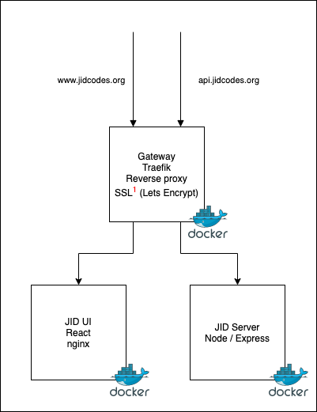

# Jota/Joti JID code deployment

This repository contains a recipe for deploying the entire JID code application
using [Docker][docker]. It's a configurable deployment using
[Docker Compose][dockercompose] and published Docker images which makes it
easy to setup a running JID code application on single server.

## Architecture

The setup consists of 3 Docker containers:

* [JID Server][jid-server] which handles the API requests and data persistence.
* [JID UI][jid-ui] which is the web app the users interacts with
* Gateway which is reverse-proxy and SSL termination based on [Traefik][traefik]

### Note

The diagram for the architecture is an drawio.png file, which means that the
diagram itself can be edited using [Diagrams.net][diagramsnet]

## Usage on Production

To deploy follow these steps:

### Step 0 - Obtain a physical/virtual server to host on

Before actually going through the usage guide, you need to make sure you
have access to an actual server, ideally running Linux. The application
itself doesn't require much, so you can probably get away with a small
machine.

The server also needs to be accessible from the internet and you need to
ensure that TCP port 80 and 443 can reach the server. These ports are the
standard internet web ports. 

### Step 1 - Domain name setup

The first step is to decide on which domain names the JID code application
should have. This is important, if you want to have SSL certificates (https)
on you JID code application.

You need two domains (probably just two CNAME's):

* One for the Backend server (API).
* One for the Frontend application (Web App).

Two give an example, we are hosting it ourselves during Jota/Joti and we use
`api.jidcodes.org` for the Backend server and `www.jidcodes.org` for the 
frontend server. If you already own a domain it is perfectly fine to create
two subdomains for use here, to avoid having to buy a new domain name.
`jid-api.mypersonaldomain.net` and `jid.mypersonaldomain.net` will work
just as well.

Make sure that both domain names point to your server's IP address BEFORE
moving on in this guide. Ideally wait until you are sure that the DNS
is updated and you have verified that the domain name now resolves to
the server IP.

### Step 2 - Install required software on server

This step assumes that you are running Linux on the server and that
you are reasonably comfortable with the command line and how to install
packages on your Linux flavor.

Packages to install (ideally from package manager):
* [Docker][docker]
* [Docker Compose][dockercompose]
* [Git][git]

### Step 3 - Download this repo and configure

This repository contains all required configuration files for setting
up the application. Start by cloning this repository to a folder of your
choice on the server by executing this command:

    # git clone https://github.com/jotajoti/jid-deploy

Now go into the folder using this command:

    # cd jid-deploy

In the `jid-deploy` folder you should now edit the [.env][envfile] file.
It has a lot of comments to help you configure it and should be self
explanatory.

After editing the file, save it

### Step 4 - Run the application

Now you are ready to start up the application. You do that while standing in
the `jid-deploy` folder and execute this command:

    # docker-compose up -d

This will bring both the backend, the frontend and the gateway up.  
If you have enabled SSL in the configuration file, the gateway will issue an
SSL certificate, if you have configured the domain name correctly
in **Step 1**.

You can verify that the site is running correctly by opening a browser
and entering the domain name for the Frontend.

[docker]: https://www.docker.com/
[dockercompose]: https://docs.docker.com/compose/
[jid-server]: https://www.github.com/jotajoti/jid-server/
[jid-ui]: https://www.github.com/jotajoti/jid-ui/
[traefik]: https://traefik.io/
[diagramsnet]: https://www.diagrams.net
[git]: https://www.git-scm.com
[envfile]: ./.env
